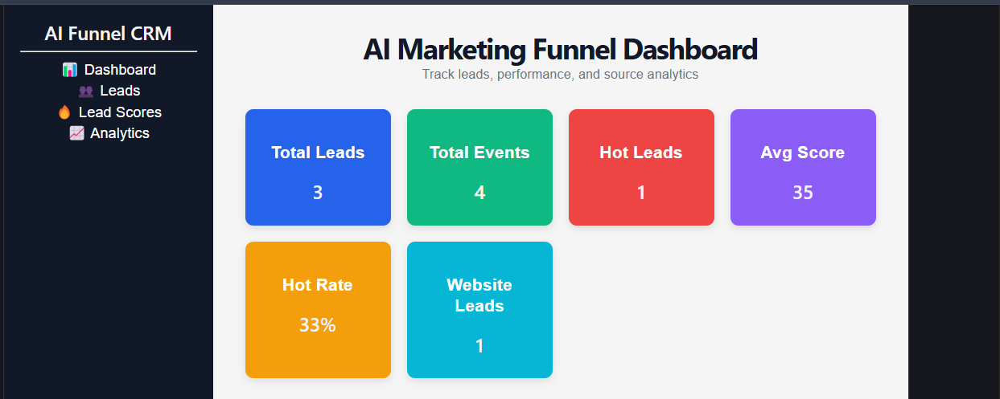
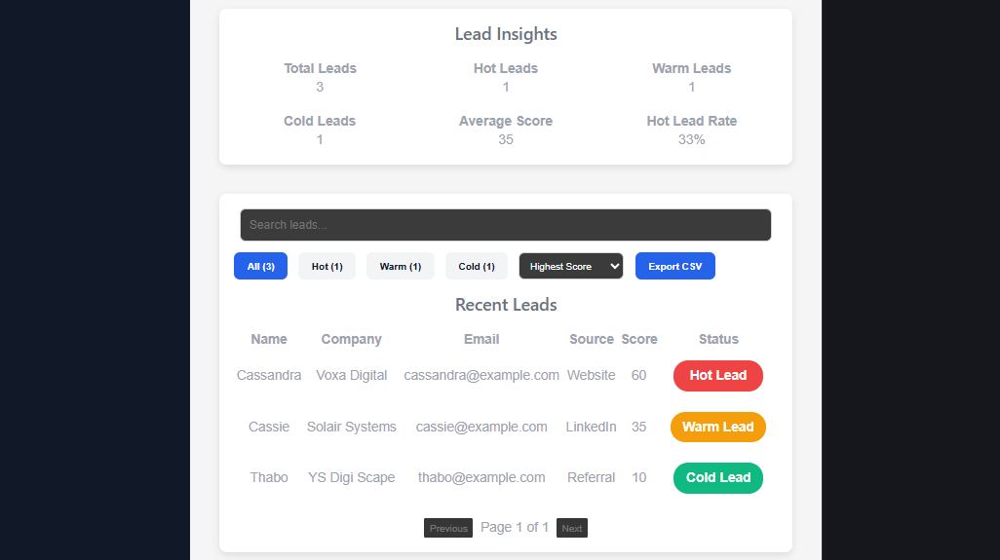
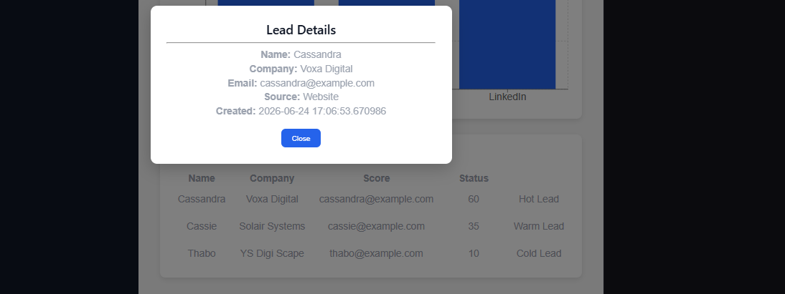
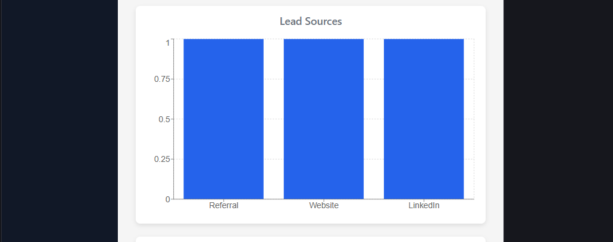

# AI Marketing Funnel CRM Dashboard

# AI Marketing Funnel CRM Dashboard

     

A full-stack marketing analytics dashboard that tracks leads, scores prospects, analyzes lead sources, and provides actionable insights for marketing teams.

A full-stack marketing analytics dashboard that tracks leads, scores prospects, analyzes lead sources, and provides actionable insights for marketing teams.

## Live Demo

Frontend:
https://ai-marketing-funnel.vercel.app

Backend API:
https://ai-marketing-funnel.onrender.com

## Overview

This project was built to demonstrate full-stack development skills using React, FastAPI, PostgreSQL, Supabase, Render, and Vercel.

The dashboard allows users to:

* View marketing leads
* Track lead scores
* Analyze lead sources
* Search and filter leads
* Export lead data to CSV
* View lead analytics and KPI metrics

## Tech Stack

### Frontend

* React
* Vite
* Recharts
* JavaScript

### Backend

* FastAPI
* Python
* REST API

### Database

* PostgreSQL
* Supabase

### Deployment

* Vercel
* Render
* Cron-job.org

## Features

### Dashboard Analytics

* KPI Cards
* Total Leads
* Total Events
* Hot Leads
* Average Lead Score
* Hot Lead Rate
* Website Lead Tracking

### Lead Management

* Search Leads
* Filter Leads by Status
* Sort Leads by Score
* Lead Detail Modal
* Pagination

### Reporting

* CSV Export
* Source Performance Analytics
* Lead Source Bar Chart

### Backend Features

* FastAPI REST API
* Lead Scoring Engine
* PostgreSQL Database Integration
* Supabase Cloud Database

### Deployment

* Frontend hosted on Vercel
* Backend hosted on Render
* Database hosted on Supabase
* Automated Render keep-awake monitoring

## Architecture

```text
Users
  ↓
Vercel Frontend (React + Vite)
  ↓
Render Backend (FastAPI)
  ↓
Supabase Database (PostgreSQL)
```

### Data Flow

1. Users interact with the React dashboard.
2. React sends requests to the FastAPI backend.
3. FastAPI processes business logic and lead scoring.
4. FastAPI retrieves and updates data in Supabase PostgreSQL.
5. The frontend displays analytics, charts, and lead information.

## API Endpoints

| Endpoint              | Description           |
| --------------------- | --------------------- |
| `/dashboard`          | Dashboard KPI metrics |
| `/leads`              | Retrieve all leads    |
| `/lead-scores`        | Retrieve lead scores  |
| `/source-performance` | Lead source analytics |

## Installation

### Clone Repository

```bash
git clone https://github.com/CasTheDev/ai-marketing-funnel.git
```

### Navigate to Project

```bash
cd ai-marketing-funnel
```

### Backend Setup

```bash
cd backend
```

Create and activate virtual environment:

```bash
python -m venv venv
```

Windows:

```bash
venv\Scripts\activate
```

Install dependencies:

```bash
pip install -r requirements.txt
```

Run FastAPI:

```bash
uvicorn main:app --reload
```

### Frontend Setup

```bash
cd frontend
```

Install dependencies:

```bash
npm install
```

Run React application:

```bash
npm run dev
```

### Environment Variables

Create a `.env` file inside the backend folder and add:

```env
DB_NAME=
DB_USER=
DB_PASSWORD=
DB_HOST=
DB_PORT=
```

## Roadmap

Future improvements planned for this project:

* User Authentication and Login System
* User Roles and Permissions
* Lead Assignment Workflow
* Email Notifications
* Automated Lead Nurturing
* CRM Integrations
* Marketing Campaign Tracking
* Advanced Reporting Dashboard
* AI-Powered Lead Recommendations
* Mobile Responsive Enhancements

## Lessons Learned

This project provided hands-on experience with:

* Full-Stack Application Development
* REST API Design
* FastAPI Backend Development
* React Frontend Development
* PostgreSQL Database Management
* Supabase Cloud Database
* Cloud Deployment with Render
* Frontend Deployment with Vercel
* Environment Variable Management
* CORS Configuration
* Git and GitHub Workflows
* Production Troubleshooting

## Author

**Sandra Mapiye**

Digital Marketing & Full-Stack Development Portfolio Project

GitHub:
https://github.com/CasTheDev

LinkedIn:
(Add your LinkedIn URL here)

Portfolio:
(Add your portfolio website URL here)

## Screenshots

### Dashboard Overview



### Lead Management



### Lead Details Modal



### Source Analytics


